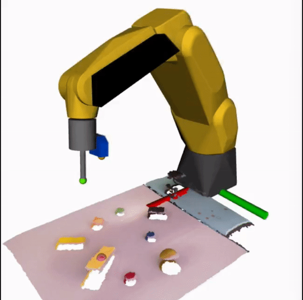

# Bin-picking

My Master Thesis

[Precision Bin-Picking using a 3D Sensor and a 1D Laser Sensor](http://lars.mec.ua.pt/public/LAR%20Projects/BinPicking/2018_JoanaMota/PDF/master_thesisJoana.pdf)

Bin-picking is the name of the technique used by a robot to grasp objects that are randomly disposed inside a box or a pallet.

My purpose with this thesis was to develop a solution for a different process of bin-picking using a 3D sensor to
generate a point cloud of the objects, and a 1D laser sensor to correctly determinate the exact distance to
the grasping point.

More information on the full process taken to develop this project in [My Master's Thesis Blog](https://joanamota.github.io)

Full video can be found [here](https://www.youtube.com/watch?v=8bcPk6gX0Rg).

|          Step1          |          Step2           |          step3          |
| :---------------------: | :----------------------: | :---------------------: |
|  |  |  |
